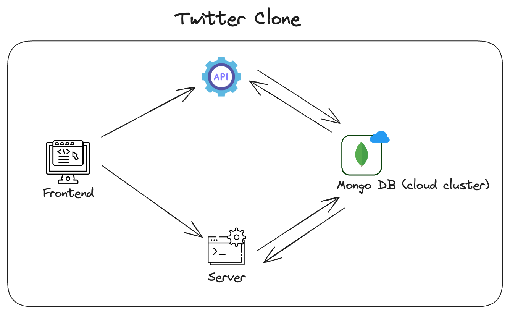

# Twitter Clone: a full-stack, real-time twitter clone

This project is a full-stack Twitter clone built with modern JavaScript technologies, allowing users to:

- Create and share posts (tweets)
- Follow other users and see their updates
- Like and reply on posts
- Retweet posts from other users
- Search for users and posts
- Experience real-time updates and chatting with Socket.IO

## Tech Stack
- Frontend: HTML, CSS, Boostrap, JQuery, JavaScript, Pug 
- Backend: Node.js, Express
- Database: MongoDB
- Real-time communication: Socket.IO

## Features
- User Authentication: Secure login and registration system.
- Feed: View posts from followed users.
- Notifications: View notifications from other users instantly.
- Messaging: Chatting with other users instantly.
- Profile Image and Banner Image upload with crop functionality.
- Responsive Design: Optimized for various screen sizes.

